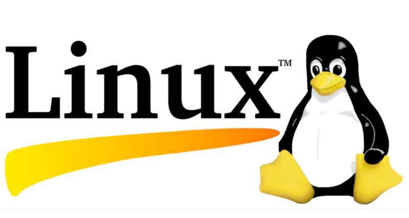

# Linux Basics Tutorial


Linux is an open-source operating system widely used for servers, desktops, and embedded devices. It’s popular among developers and system administrators due to its open-source nature and high customizability. If you're a beginner, this guide will help you get started with some essential concepts and commands in Linux.

---

### 1. **Linux Directory Structure**

Linux uses a hierarchical file system, where all files and directories are located under the root directory (`/`). Below are some common directories and their uses:

- `/`: Root directory, the starting point for all other directories and files.
- `/home`: User directories. Each user typically has a directory here, like `/home/username`.
- `/bin`: System binary executables and essential command files.
- `/etc`: Configuration files for the system and installed software.
- `/var`: Variable data files, like log files, mail, and cache.
- `/usr`: User programs and data, such as applications and libraries.
- `/tmp`: Temporary files.

### 2. **Basic Commands**

Learning some common Linux commands is essential for using the system effectively. Here are some basic commands:

#### 2.1 **File and Directory Operations**
- **`pwd`**: Displays the full path of the current directory.
- **`ls`**: Lists files and directories in the current directory.
  - `ls -l`: Lists files in detailed format.
  - `ls -a`: Lists all files, including hidden files (those starting with `. `).
- **`cd <path>`**: Changes the current directory to `<path>`. For example, `cd /home/username`.
  - `cd ..`: Moves up one directory level.
  - `cd ~`: Moves to the user's home directory.
- **`mkdir <directory>`**: Creates a new directory.
- **`rmdir <directory>`**: Removes an empty directory.
- **`rm <file>`**: Deletes a file.
  - `rm -r <directory>`: Deletes a non-empty directory and its contents.
  - `rm -f <file>`: Forces deletion of a file, ignoring errors.

#### 2.2 **Viewing and Manipulating File Contents**
- **`cat <file>`**: Displays the contents of a file.
- **`less <file>`**: Displays the contents of a file one page at a time, allowing scrolling.
- **`head <file>`**: Displays the first few lines of a file.
- **`tail <file>`**: Displays the last few lines of a file.
- **`grep <pattern> <file>`**: Searches for a pattern (string) in a file.

#### 2.3 **Package Management**
In Linux, software is often managed through package managers, which vary by distribution. Common package managers are `apt` (Ubuntu/Debian), `yum` (CentOS/RHEL), and `dnf` (Fedora).

- **Ubuntu/Debian** (APT):
  - `sudo apt update`: Updates the package database.
  - `sudo apt upgrade`: Upgrades installed packages.
  - `sudo apt install <package>`: Installs a package.
  - `sudo apt remove <package>`: Removes a package.

### 3. **Common Linux Operations**

#### 3.1 Create a New Directory and Edit a File
1. Create a directory named `my_project`:
   ```bash
   mkdir my_project
   cd my_project
   ```
2. Create a file `hello.txt` and add text:
   ```bash
   echo "Hello, Linux!" > hello.txt
   cat hello.txt
   ```

#### 3.2 Install a Package
For example, to install `git` on Ubuntu:
```bash
sudo apt update
sudo apt install git
```

#### 3.3 View File Contents
View the contents of `hello.txt`:
```bash
cat hello.txt
```

#### 3.4 Search for a File
To search for the `my_project` folder in the `/home` directory:
```bash
find /home -name "my_project"
```


### 4. **Text Editors in Linux**
Linux offers several text editors for editing files:

- **nano**: A simple, user-friendly terminal text editor.
  - Open a file: `nano <filename>`
  - Save and exit: `Ctrl + O` (save), `Ctrl + X` (exit).
  
- **vim**: A powerful text editor, preferred by many for programming and efficient text manipulation.
  - Open a file: `vim <filename>`
  - Enter insert mode: `i`
  - Save and exit: `Esc` + `:wq`

### 5. **Basic Network Commands**
- **`ping <hostname>`**: Tests network connectivity by sending ICMP packets.
- **`ifconfig`** or **`ip addr`**: Displays network interface information.
- **`curl <url>`**: Accesses a URL or downloads a file from the command line.