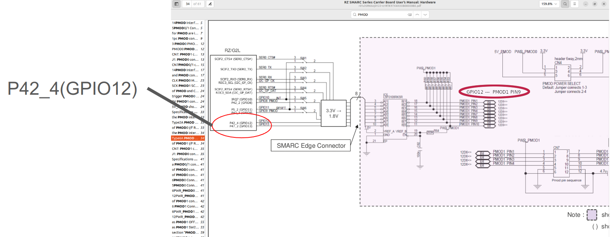
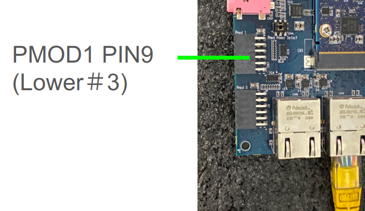
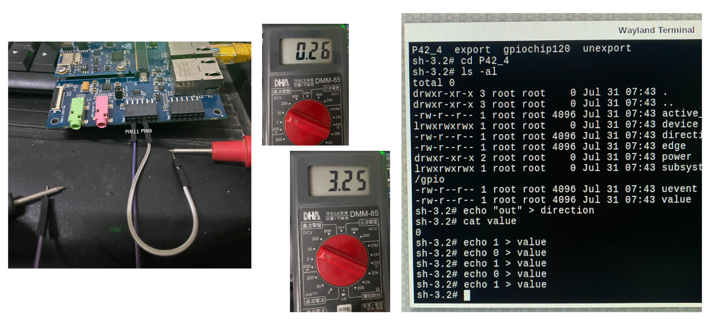

# 4-4 Control GPIO Hardware from C/ C++ Program

Access GPIO pins through the file system using the sysfs interface.

[how-control-gpio](https://www.ics.com/blog/how-control-gpio-hardware-c-or-c)

Example code :

```cpp
int fd = open("/sys/class/gpio/export", O_WRONLY);
   if (write(fd, "460", 2) != 2) {
       perror("Error writing to /sys/class/gpio/export");
       exit(1);
    }
 close(fd);
```

Find out where is the hardware pin for P42_4?

[RZ SMARC Series Carrier Board User’s Manual: Hardware](https://www.renesas.com/en/document/mat/rz-smarc-series-carrier-board-users-manual-hardware?r=1518686)

Check Page 34, Figure 2.16 Block Diagram of PMOD1 I/F





We can test GPIO P42_4 at PMOD1 #9 Pin with a multimeter.

:::[Caution]
Be careful not to burn your board!  
:::



**Reference program**  

Check out the example code at Github Repo :

[rzgpio](https://github.com/yourskc/rzgpio.git)

Please follow the instructions in the README.md to build the project, then copy the output executable to RZ/G2L for testing.  
