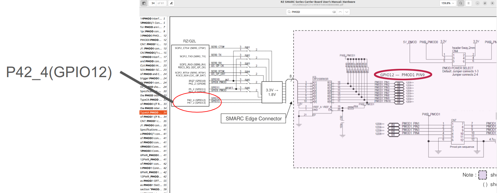
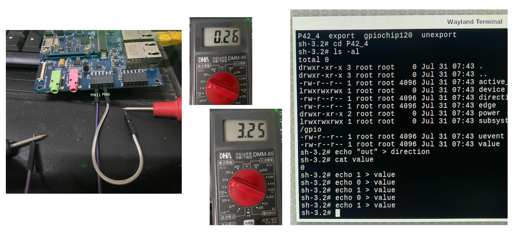
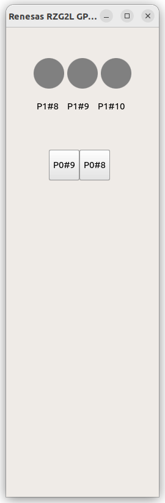

# 4-1 Indroduction

In this chapter, we will show you how to perform tests and develop program to control the GPIO hardware pins of Renesas RZ/G2L under the Linux environment

Please reference the below document to understand how the use Linux Sysfs.
In Linux, we usually control I/O pin through the read/write of some specific files. We also need to follow the command sequence.  

Our first step is to use 'echo' command to write value and use 'cat' command to show the content of a file. we will write the all of the commands as a program after the command-line test. The below is the Renesas official document,  

[RZ/G Verified Linux Package (5.10-CIP)](
https://www.renesas.com/en/products/microcontrollers-microprocessors/rz-mpus/rzg-linux-platform/rzg-marketplace/verified-linux-package/rzg-verified-linux-package#Download)

Under "Related Document", Click on the item:  

```text
For RZ/G2L Group
RZ/G2L,Five,V2L Group BSP Manual Set (RTK0EF0045Z9000AZJ-v3.0.6.zip) (ZIP)
```

or directly download by the below link,

<https://www.renesas.com/en/document/mas/rzg2-group-bsp-manual-set?r=1597481>

Decompress the file " RTK0EF0045Z9006AZJ-v3.0.6.zip", find the below GPIO document,

```text
r01us0488ej0109-rz-g_GPIO_UME.pdf
```

## 4-2 Linux GPIO Driver

sysfs is a pseudo file system provided by the Linux kernel that exports information about various kernel subsystems, hardware devices, and associated device drivers from the kernel's device model to user space through virtual files. In addition to providing information about various devices and kernel subsystems, exported virtual files are also used for their configuration.

<https://en.wikipedia.org/wiki/Sysfs>

In Linux, we usually use these 2 simple commands to access files  

- READ content from a file

```bash
cat filename
```

- WRITE content to a file

```bash
echo xxx > filename
```

**Linux GPIO Sysfs Interface**  

Please reference to the document first,

<https://www.kernel.org/doc/Documentation/gpio/sysfs.txt>

The important steps:

1. Ask kernel for the control privilege

/sys/class/gpio/

for example, to get the control privilege of GPIO19

```bash
cd /sys/class/gpio
echo 19 > export  74
```

2. Set read/write direction,  

/sys/class/gpio/gpioN/

For example,  

```bash
echo "out" direction
```

We actually input the below Linux commands on Renesas RZ/G2L  

```bash
cd /sys/class/gpio
echo 19 > export
```

We would get the below error message:  

```bash
invalid argument
```

Since that GPIO number doesn't exist,  

## 4-3 Renesas GPIO definition

Reference to the below Renesas GPIO document we mentioned in 4-1

[r01us0488ej0109-rz-g_GPIO_UME.pdf](https://www.renesas.com/en/document/mas/rzg2-group-bsp-manual-set?r=1597481)

RZ/G2L can support up to 123 general-purpose I/O pins from 49 ports
( Page 8. Table )

**Formula** :

 Page 14. in the above document:


For example: P42_4

id of ```P42_4``` = 42 * 8 + 4 + 120 = 460.  

It is used to export a GPIO pin in userspace.

Table 4-1 Example GPIO device nodes of RZ/G2L
( Page 16. in the above document)


**Test** :

```bash
cd /sys/class/gpio
echo 460 > export
ls -al 
```

A new folder will be shown,

```bash
P42_4
```

Check the description about P42_4
in the above document,


Continue the below testing,

```bash
echo 1 > value ( error )
cat direction 
in
echo “out” > direction 
cat direction
out
echo 1 > value
cat value
echo 0 > value
cat value
```

**Carrier Board**  

Now we want to find out the pin corresponding. Check the document of the carrier board.

Check the item  

```text
"Documentation"/ "Manual - Development Tools"/
"RZ SMARC Series Carrier Board User's Manual:Hardware"
```

in the below Renesas document,

[RZ/G2L-EVKIT - Evaluation Board Kit for RZ/G2L MPU](
https://www.renesas.com/en/products/microcontrollers-microprocessors/rz-mpus/rzg2l-evkit-evaluation-board-kit-rzg2l-mpu#documents)

## 4-4 Control GPIO Hardware from C/ C++ Program

Access GPIO pins through the file system using the sysfs interface.

<https://www.ics.com/blog/how-control-gpio-hardware-c-or-c>

Example code :

```cpp
int fd = open("/sys/class/gpio/export", O_WRONLY);
   if (write(fd, "460", 2) != 2) {
       perror("Error writing to /sys/class/gpio/export");
       exit(1);
    }
 close(fd);
```

Find out where is the hardware pin for P42_4?

[RZ SMARC Series Carrier Board User’s Manual: Hardware](https://www.renesas.com/en/document/mat/rz-smarc-series-carrier-board-users-manual-hardware?r=1518686)

Check Page 34, Figure 2.16 Block Diagram of PMOD1 I/F




We can test GPIO P42_4 at PMOD1 #9 Pin with a multimeter.

:::[Caution]
Be careful not to burn your board!  
:::



**Reference program**  

Check out the example code at Github Repo :

<https://github.com/yourskc/rzgpio.git>

Please follow the instructions in the README.md to build the project, then copy the output executable to RZ/G2L for testing.  

## 4-5 Control GPIO using C++ Class in Qt Project

**Qt - GPIO Button**  

Please reference to the Repository :

<https://github.com/yourskc/q563_rzgpio/>

The most important concept in this project is how to link QML to our C++ class. All of our GPIO control functions through Linux driver are all inside the C++ class.  

The below are some important concepts in the above programs.

**Register a C++ class to use from QML**  

If you need to register a C++ class to use from QML, you can declaring your QQmlApplicationEngine and assign it as the parent of your object.

Reference :  

<https://doc.qt.io/qt-6/qqmlengine.html#qmlRegisterType>

Once this is registered, the type can be used in QML.

in main.cpp

```cpp
#include <rzgpio.h>
...
int main(int argc, char *argv[])
{
QGuiApplication app(argc, argv);
QQmlApplicationEngine engine;   

RzGPIO* rzgpio = new RzGPIO(&engine);
QQmlContext* context = engine.rootContext();
context->setContextProperty("RzGPIO", rzgpio);

engine.load(QUrl(QStringLiteral("qrc:/main.qml")));

return app.exec();
}
```

main.qml :

```qml
Button {
x:70
y:200
...
onClicked : {
        if (thismain.led2 === 0) {
            RzGPIO.Write(2, 1);
            thismain.led2=2;
            }
            else {
                RzGPIO.Write(2, 0);
                thismain.led2=0;
                }

            }


```

**QTimer** :

Reference to Qt "Analog Clock" under Examples/gui/analogclock/, we can add timer in Qt Control.

```qml
  Timer {
        interval: 100; running: true; repeat: true;
        onTriggered: clock.timeChanged()
    }
```

## 4-6 Hwardware testing

**PMOD Interface**  

Pmod interface (peripheral module interface) is an open standard defined by Digilent in the Pmod Interface Specification for connecting peripheral modules to FPGA and microcontroller development boards using 6 pins. Pmod or Pmods may also refer to modules compatible with the Pmod interface.

Pmods come with a standard 6-pin interface of 4 signals, one ground and one power pin

PIN#5 = GND

PIN#6 = Vcc

Pmods can use either SPI, I2C or UART protocol.

<https://en.wikipedia.org/wiki/Pmod_Interface>

We will test GPIO pins using PMOD button and PMOD Led small board.

**PMOD Button**:

<https://digilent.com/reference/pmod/pmodbtn/start>


**PMOD Led** :

<https://digilent.com/reference/pmod/pmodled/start>


Clone and build the below Github repository:

<https://github.com/yourskc/q563_rzgpio/>

For the matching to the configurations in our software program, plug the PMOD board
to Renesas RZ/G2L. Connect the Led board to the lower pins of PMOD0 on Renesas carrier board, and connect the button board to the lower pins of PMOD1.  


Transfer the executable q563_rzgpio to Renesas RZ/G2L, then run it,

```bash
./q563_rzgpio
```



This is a two-way test, click the button on the screen will see the on/off of Led, click on the PMOD buttons will see the color change of the red light on screen.  

[](https://www.youtube.com/watch?v=5rZZOqaB67k)
