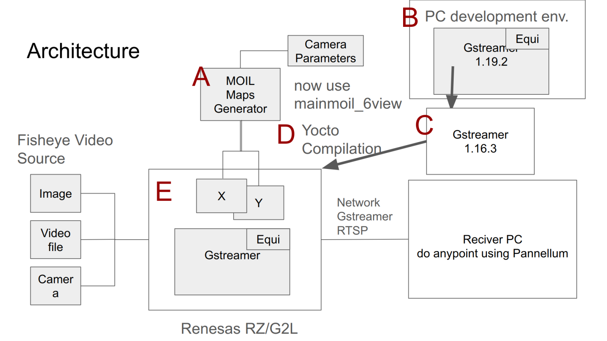

# 2-1 Introduction

GStreamer is an extremely powerful and versatile framework for creating streaming media applications. However, writing new plugins is not always easy.

We already have a MOIL Equirectangular Gstreamer element, we hope to use it to link to more applications.

This chapter introduces the MOIL fisheye image processing technology implemented on the Renesas RZ/G2L hardware platform.

Due to the limited development and runtime performance of embedded systems, we initially develop and test on a PC and later deploy to the target hardware through cross-platform compilation.

Our goal is to implement MOIL image processing technology on the Renesas RZ/G2L, enabling image streaming over a network and fostering further system development on PC or other hardware environments.

The architecture is as follows:



The development process is described step by step:

- Generating the Remap Mapping Files

- Setting up the development environment using the `gst-plugins-bad-dev` project for GStreamer

- Preparing the Renesas version of the `gst-plugins-bad` project and integrating the MOIL source code

- Compiling the Yocto project on PC and writing the bootable image to an SD card

- Booting Renesas RZ/G2L with the Yocto image and testing on the target board

The following sections detail these steps. We will write some cpp programs in the process.

Before we start, there are some basic C and C++ programming skill we need to know. Please reference the links below,

**C** :

C is a general-purpose programming and powerful language that has been widely used for over 50 years.

[c_intro](https://www.w3schools.com/c/c_intro.php)

**C++** :  

C++ is an object-oriented programming language. C++ includes the standard C runtime library as a subset,

[cpp_intro](https://www.w3schools.com/cpp/cpp_intro.asp)

and

[MinerT_Class](https://hackmd.io/@Mes/MinerT_Class)

A very simple C++ class example is as below,

```cpp
#include <iostream>  

class T {  
  int val;  

public:  
  T() : val() {}  

  void set_other_val(T &other) { other.val = 100; };  
  int get_val() { return val; }  
};  

int main()  
{  
  T t1, t2;  
  t1.set_other_val(t2);  
  std::cout << t2.get_val();  
} 
```

In the actual situations, we usually use a .h and an .cpp separately. Like the below,

In ```Vending_machine.h```,

```cpp
#ifndef VENDING_MACHINE  
#define VENDING_MACHINE  

class Vending_machine {  
public:  
  void ordered_chicken();  
  int money();  

private:  
  int price;  
};  

#endif 
```

In ```Vending_machine.cpp```

```cpp
#include "Vending_machine.h"  
#include <iostream>  

void Vending_machine::ordered_chicken()  
{  
  std::cout << "the machine get your order\n";  
  price = 50;  
}  

int Vending_machine::money()  
{  
  return price;  
}  
```

Then we can use the above class in our main.cpp as  below,

```cpp
#include <iostream>
#include "Vending_machine.h"
int main()  
{  
  Vending_machine machine1, machine2;  

  machine1.ordered_chicken();  
  std::cout << machine1.money();  
}  
```

Compile and link：

```bash
g++ main.cpp Vending_machine.cpp
```

Run:

```bash
./a.out
```

Expected output:

```bash
the machine get your order
50
```
