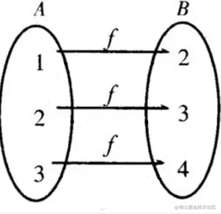

# 2-2 Generating Remap Mapping Files

We aim to develop a GStreamer filter to transform fisheye images into corrected single-angle or equirectangular images. This transformation requires reading a set of X, Y mapping tables to reposition each point, known as remap maps.

For two sets A and B, The mapping function is  



for every element b in B, b = f(a), f is the mapping function

For image remapping, we denote it as  

```math
g(x,y) = f(h(x,y))
```

If our platform support **OpenCV**, we can use the remap() function to achieve this. Or, for GStreamer, we make a image filter element to do it.

Since MOIL fisheye image Anypoint and Panorama calculations involve trigonometric functions, performance would be better on PCs with NVidia GPUs. However, targeting on Renesas RZ/G2L, we will first pre-calculate these maps and perform only remap operations at runtime for optimal performance.

To generate these remap maps on a PC, please download, compile, and run the following GitHub project:

**GitHub:** [https://github.com/cjchng/mainmoil_6view](https://github.com/cjchng/mainmoil_6view) (private)

Configure the parameters according to your camera, execute the program and select:

```bash
4. Full Map
```

This will generate usable X, Y maps.

:::tip [Fisheye Camera Parameters]
Ensure the fisheye camera parameters are set in the program before generating maps for correct equirectangular transformation from the connected fisheye camera.
:::

:::tip  
If you don't have a fisheye camera with the calibration parameters, you can skip this step and use the  
ready-made X,Y Maps in the next section.

:::  

## MOIL Maps Generator ( New )

The **MOIL Maps Generator** website offer an online interface that we can get the X,Y map files used on GStreamer command.  

Input the camera and some additional parameter then plress "Start" Button to start the generation. A Zip file will be downloaded, please click on "Keep" when the browser prompt the security concern. Decompress the zip file before using. If you generate maps other than **Equirectangular**, please rename then to EquimatX, and EquimatY before you use them for Gstreamer command.  

The website URL is,

<http://140.112.12.82/moilmapgen/>


