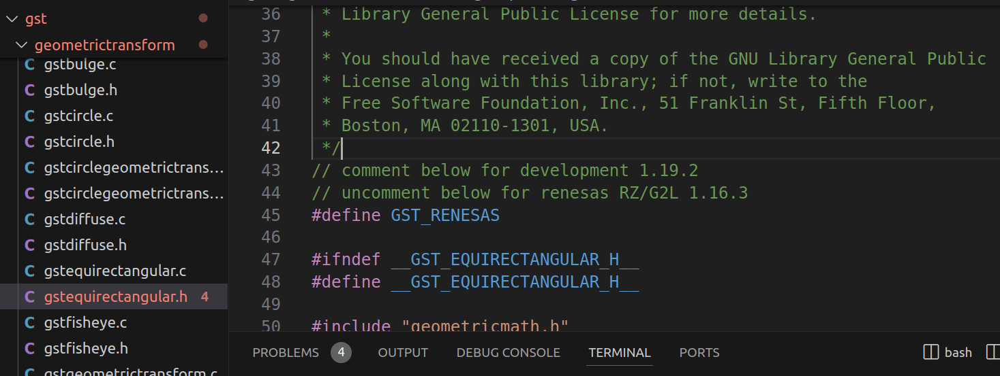
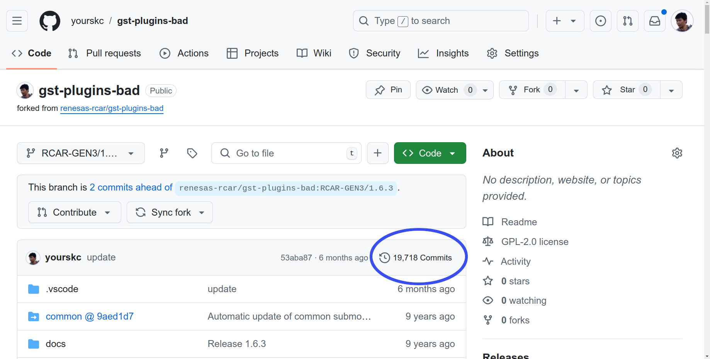

# 2-4 Preparing `gst-plugins-bad` Project for Yocto Compilation

Clone the project,  

```bash
git clone https://github.com/yourskc/gst-plugins-bad.git
```

:::tip
if you intent to modify as your own copy, fork
the repository, and remember to set the commit ID
corresponding to your copy before the Yocto build.  
:::

Check out the appropriate branch:

```bash
git checkout RCAR-GEN3e/1.16.3
git branch
```

:::tip
The above cloned repository is ready to used
for the Yocto build in the next section.  
You can skip the remaining description and jump to the next section if you just want to use the  

Or, if you want to modify the source code mentioned in the previous 2-3 section - "gst-plugins-bad-dev" project, you need to do  
the remaining steps.  
:::

Perform the steps,  

- Copy `gstequirectangular.c` and `gstequirectangular.h` under gst/geometrictransform/  

in the development project 'gst-plugins-bad-dev' into the corresponding directory in 'gst-plugins-bad' project.

- Uncomment the `#define GST_RENESAS` definition line in the source program.



- Commit, push and remember the commit ID  

```bash
git commit -m "comment"
git push
```

Get the commit ID in for folder:

```bash
cat .git/refs/heads/RCAR-GEN3e/1.16.3
```

or, on the below Github page,  

[Github](https://github.com/yourskc/gst-plugins-bad/tree/RCAR-GEN3/1.6.3)

In the upper-right corner of the file list, click on the ```nnn Commits```, there is  



Since the project in section 2-3 is build with ```Meson build```. However, this project is build with ```GNU Automake```  

The build commands are as below,

```bash
./autogen.sh
make
```

This project is depend on some other packages. If you  
would like to try to build the project, we would suggest  
you try the compile process in Ubuntu 20.04.  

However, since we already verify the corressness of the
programs in the previous 2-3 section. We also can skip  
the build process in this stage.

:::tip

Compare to the original official gst-plugins-bad project,
our project added equirectangular.c and .h files, and also  
midified some related sources. If you wish to add more  
new functions, You should also modify those files accordingly.  
:::
