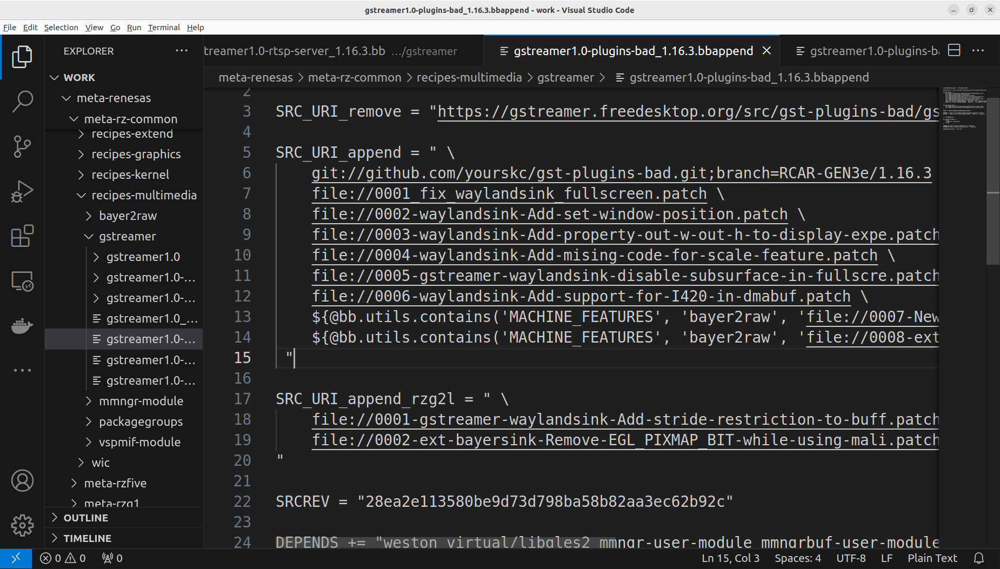
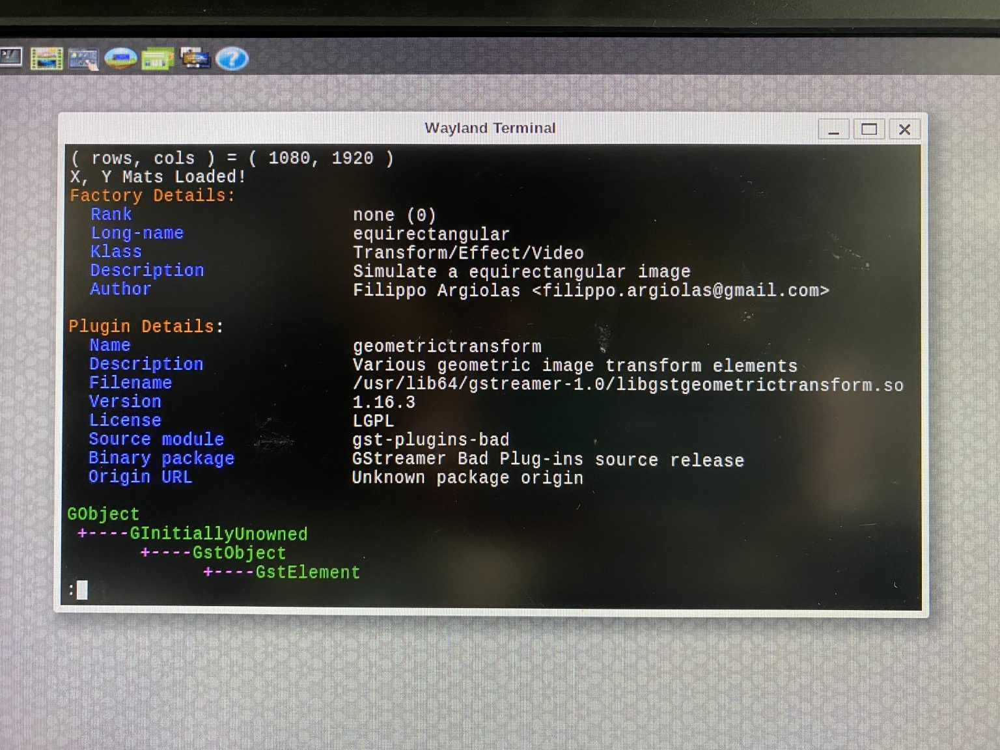

# 2-5 Editing Recipes and Recompiling Yocto Project

Please ensure you already have a Docker container
for Yocto project compilation.

Refer to Section 1-1 for setting up the Yocto build environment.

Edit the below `.bbappend` file in your Yocto project folder

```bash
meta-renesas/meta-rz-common/recipes-multimedia/gstreamer/gstreamer1.0-plugins-bad_1.16.3.bbappend
```

Modify the first line in SRC_URI_append:

```bash
SRC_URI_append = " \
git://github.com/yourskc/gst-plugins-bad.git;branch=RCAR-GEN3e/1.16.3 \
```

Insert the SRCREV line:

```bash
SRCREV="<commit ID>"
```

for example,

```bash
SRCREV="28ea2e113580be9d73d798ba58b82aa3ec62b92c"
```

As below,  



Re-compile the Yocto image and write it to an SD card:

```bash
MACHINE=smarc-rzg2l bitbake core-image-qt
...

```bash
sudo bmaptool copy <image>.wic.gz /dev/sdX
```

Then we can perform testings on RZ/G2L

Boot the RZ/G2L board and verify if the library exist with:

```bash
gst-inspect-1.0 equirectangular
```

The output would be as below, it reveal the exist
of equirectangular element in the Gstreamer library



Prepare working directories,  

```bash
cd /home/root
mkdir gst-work
cd gst-work
```

transfer test data from PC:

```bash
scp -r user@IP:/path/to/test_env/* .
```

for example,  

```bash
scp -r skc@192.168.0.105:/home/skc/gst-work/gst-plugins-bad-dev/test_env/* .
```

Ensure `EquimatX` and `EquimatY` are in the directory before
running of gst-launch-1.0 command with equirectangular  
filter.

:::tip[The filesize calculation of X,Y Maps]

Suppose the resolution is 1920 x 1080,
each points use 4 bytes,
with additional 16 bytes header,
the filesize will be 8,294,416 bytes

Caculation : 1,920 x 1,080 x 4 + 16 = 8,294,416

:::
