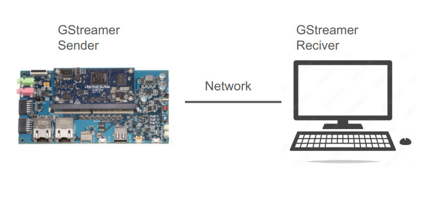
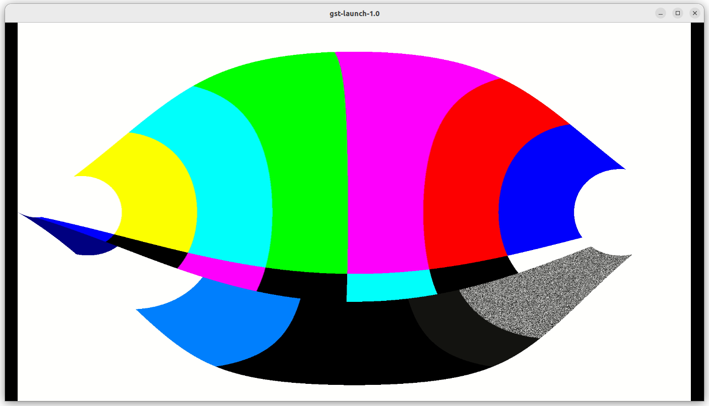

# 2-6 GStreamer Streaming Tests

In this section, we will perform streaming tests first on PC/Ubuntu 22.04, then try the similar commands on RZ/G2L with hardware-specific encoder/decoder adjustments.
Then We'll test the video streaming from RZ/G2L to PC using GStreamer commands.  



**Basic test**:

First, we can take a look at the simple video test source,

( RZ/G2L )

```bash
gst-launch-1.0 videotestsrc ! autovideosink
```


We then perform a simple test to make sure equirectangular filter work properly

( RZ/G2L )

```bash
gst-launch-1.0 videotestsrc ! video/x-raw,width=1920,height=1080 ! videoconvert ! equirectangular ! videoconvert ! autovideosink
```

:::tip
Make sure if the X,Y Maps are exist in the folder,

EquimatX, EquimatY
:::

The output screen is as below,



**Streaming testing**:

We prepare to do a streaming test from RZ/G2L to PC,  

First, open a terminal on Ubuntu 22.04, wait for
receiving h.264 stream from RZ/G2L.  

( PC )

```bash
gst-launch-1.0 udpsrc port=5000 ! application/x-rtp,media=video,clock-rate=90000,encoding-name=H264,payload=96 ! rtph264depay ! avdec_h264 ! autovideosink
```

:::tip[Reference]  

Ref. to this Gist, GStreamer UDP stream examples

https://gist.github.com/yourskc/1a29c2de32e45764b8cf914fd7240b7c
:::

Below various test scripts are outlined for video streaming with increasing complexity, including decompression, processing, and compression steps.

You can use scripts and data under /test_env folder for test

1. mp4 video file > streaming

Please change the IP address and file name in the .sh script in the following,

run the script on RZ/G2L

```bash
run1.sh
```

or run the command below

```bash
gst-launch-1.0 -e filesrc location=./endo01.mp4 ! qtdemux ! queue ! \
h264parse ! video/x-h264, stream-format=avc,alignment=au ! rtph264pay pt=96 name=pay0 \
config-interval=3 mtu=6000 ! udpsink host=192.168.0.105 port=5000
```

The result is as below,

[](https://www.youtube.com/watch?v=gU_vH49LFrU)

2. mp4 video decompression > compression > streaming

:::tip
Two important Gstreamer elements used on Renesas RZ/G2L  

h.264 decoder: omxh264dec  
h.264 encoder: omxh264enc  
:::

Please change the IP address and file name in the .sh script in the following,

run the script

```bash
run2.sh
```

or run the command below

```bash
gst-launch-1.0 -e filesrc location=./endo01.mp4 ! qtdemux ! queue ! \
h264parse ! omxh264dec ! omxh264enc ! rtph264pay config-interval=10 ! udpsink host=192.168.0.105 port=5000
```

3. mp4 video decompression > image processing ( equirectangular ) > compression > streaming

Please change the IP address and file name in the .sh script in the following,

run the script

```bash
run3.sh
```

or run the command below

```bash
h264parse ! omxh264dec ! videoconvert ! equirectangular ! videoconvert ! omxh264enc ! 
rtph264pay config-interval=10 ! udpsink host=192.168.0.105 port=5000
```

[](https://www.youtube.com/watch?v=p5NOGUasSQM)

:::tip  
Since the execution speed is slower, some frames
could be droped during the playback.  
A longer mp4 test file would lead to better
result.
:::

4. mp4 video decompression > image processing ( equirectangular) > display

This test is simpler than  
the previous one. We can use it to compare the speed.  

Please change the IP address and file name in the .sh script in the following,

run the script

```bash
run4.sh
```

or run the command below

```bash
gst-launch-1.0 -e filesrc location=./endo01.mp4 ! qtdemux ! queue ! \
h264parse ! omxh264dec ! videoconvert ! equirectangular ! videoconvert !
 autovideosink
```

Result output:

[](https://www.youtube.com/watch?v=66BR8egNx50)

:::tip  
Since the execution speed is slower, some frames
could be droped during the playback.  
A longer mp4 test file would lead to better
result.
:::

The execution result on PC for comparison:  

[](https://www.youtube.com/watch?v=Y4KDGOf6I40)
