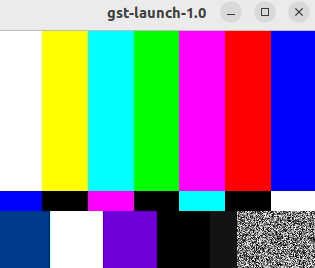

# 4.2.3 Usage Guide

Set the `GST_DEBUG` environment variable

```bash
export GST_DEBUG="GST_TRACER:7"
```

Set the `GST_TRACERS` environment variable

```bash
export GST_TRACERS="cpuusage;proctime;framerate"
```

Set the `GST_SHARK_LOCATION` environment variable

```bash
export GST_SHARK_LOCATION="$HOME/workspace/tmp/gst-shark"
```

Run the GStreamer Pipeline

```bash
gst-launch-1.0 videotestsrc ! autovideosink
```


