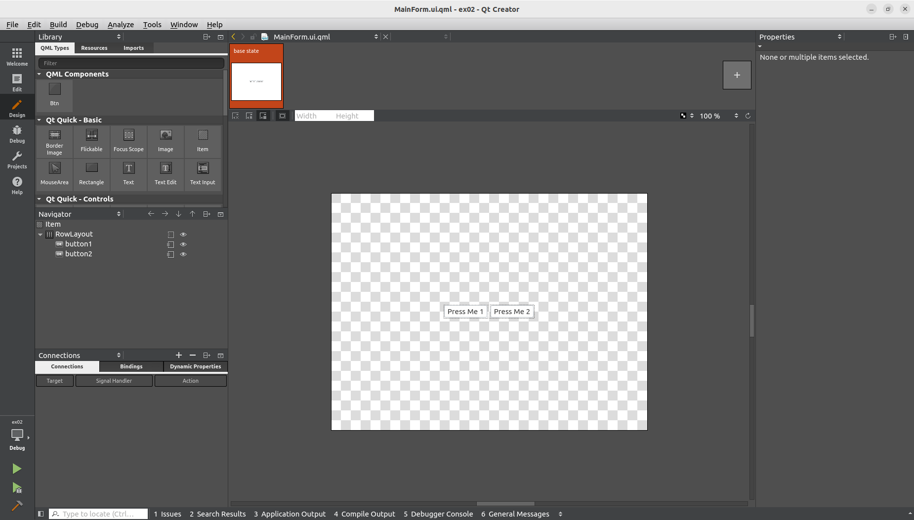
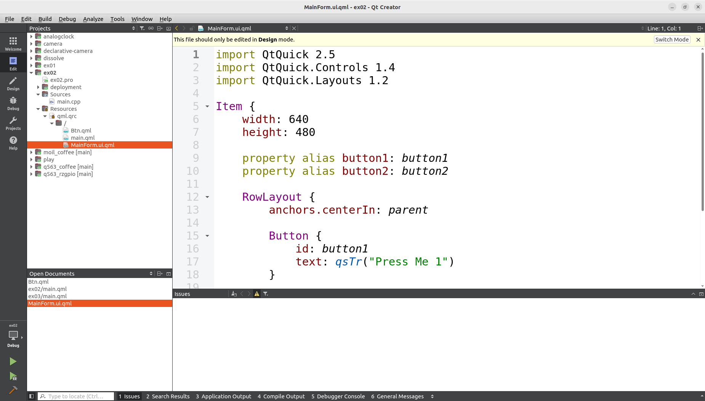
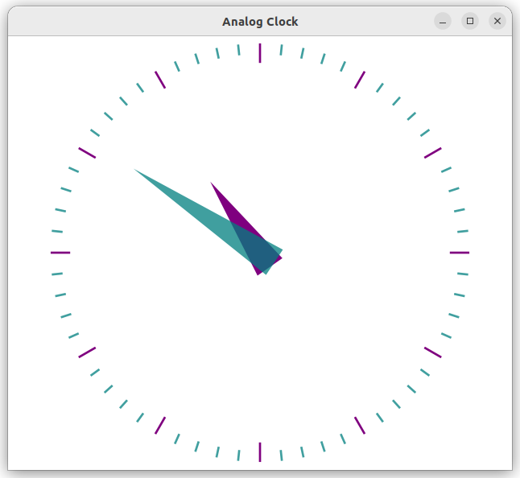
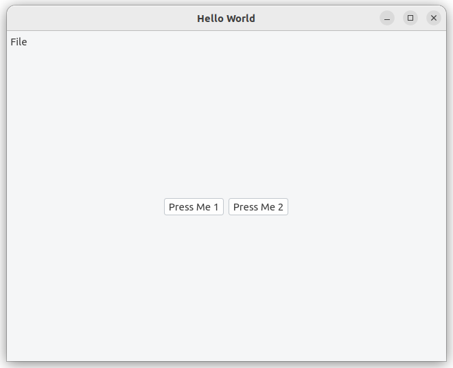
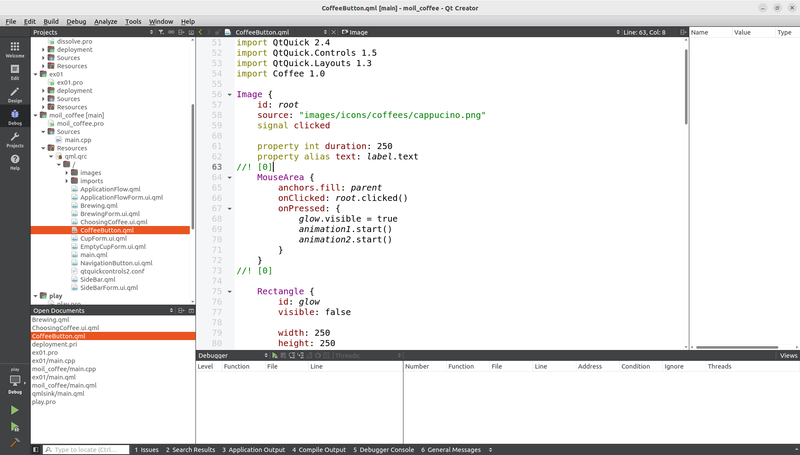

# 3-5 Build Qt Project on Ubuntu 22.04

We are about to create a Qt project, open an example  
project for pratice or create a blank new project.  

**Examples**  

Open Qt Creator, click on the ```Welcome``` on the left, click on ```Examples``` and browse to example or existing projects,  

Or, you can create a blank project,

[](https://www.youtube.com/watch?v=LNVMQhFXNHA)

On the upper-left project folder tree, double click on file "MainForm.ui.qml", Qt will switch to Design mode immediately.  



Under Design mode, we can drag the objects like buttons, or drag the contols from the left side to the center canvas. You also can click on anyone of the control list, then set it's properties on the right-hand side. We can click the 'Edit' to switch the window back to Edit mode to see all of the changes.  



You can switch among the Design mode and Edit mode the compare the dirrerences.  

The below video shows a simple pratice of QML. A qml file named Btn.qml is created, then used in the main.qml.

[](https://www.youtube.com/watch?v=w_-jhwnOFvY)

Btn.qml :

```qml
import QtQuick 2.5
import QtQuick.Controls 1.4
import QtQuick.Layouts 1.2
        Button {
            width: 100
            height: 50
            id: button1
            text: qsTr("Hello")
        }
```

Qt Examples are located at the directory as
below, projects are in the sub-directories by catagory

```bash
<Qt Dir>/Examples/Qt-5.6.3/ 
```

for example, if Qt is install under ~  

```bash
 ~/Qt5.6.3/Examples/Qt-5.6.3/
```

Please learn Qt from those examples, In Qt Creator,  
Click on File/"Open File or Project"

Browse to Examples/gui/analogclock/analogclock.pro

Click on "Run" button in the lower left corner



**New Project**  

In the menu, choose ```File/ New File or Project/```  

Choose  ```"Application"/ "Qt Quick Control Application"```

Input project name, for example ```ex01```

In "Kit" selection dislog, choose "Desktop Qt 5.6.3 GCC 64bit"

Press green triangle button on the lower-left or press F5 or Ctrl-R to start execution

Since the selected kits is "Desktop", the built executables can be run on PC as below,  



The executable would be in another folder named as  

```/build-ex01-Desktop_Qt_5_6_3_GCC_64bit-Debug```

you can also double click on the executable to run it outside of At Creator.

The success of the above steps means We've completely build a environment for development.

You can do the software development to meet your project need by repeating the programming and debugging procedures.  

Start from some example projects come with Qt installation is a good way to quickly learn the Qt UI programming. You can add controls like buttons, design the layout, and write program behind the controls to connect them with others.  

For Qt Programming,  
you can start by familiar with those topics,

- QML

QML (Qt Markup Language) is a programming language based on JavaScript, used to design applications based on graphical user interfaces. QML is mainly used for mobile applications, focusing on touch input and user experience.

[](https://www.youtube.com/watch?v=4U7j-B1mq00)

A .qml file example is as below  



please notice the top few lines looks like,

```qml
import QtQuick 2.4
import QtQuick.Controls 1.5
```

- Qt Quick

Different from Qt Widget,
Qt Quick is a function library of QML Class and Functions that uses QML language to develop graphical interfaces.

[](https://www.youtube.com/watch?v=6zmQ2yuXxY0)

- Qt Quick Controls

Qt Quick Controls is an interface module in the Qt framework, which provides a set of visual user control components. It includes buttons, text input boxes, sliders, etc.  

[](https://www.youtube.com/watch?v=uuhmSZxK1mk)

:::tip  

Most of the search result about Qt could be of newer version. We are using Qt5.6.3, aware of the differences.  

:::
