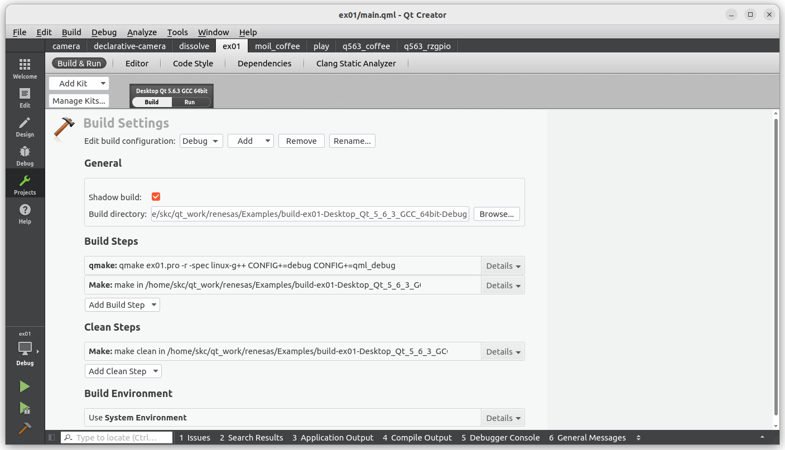
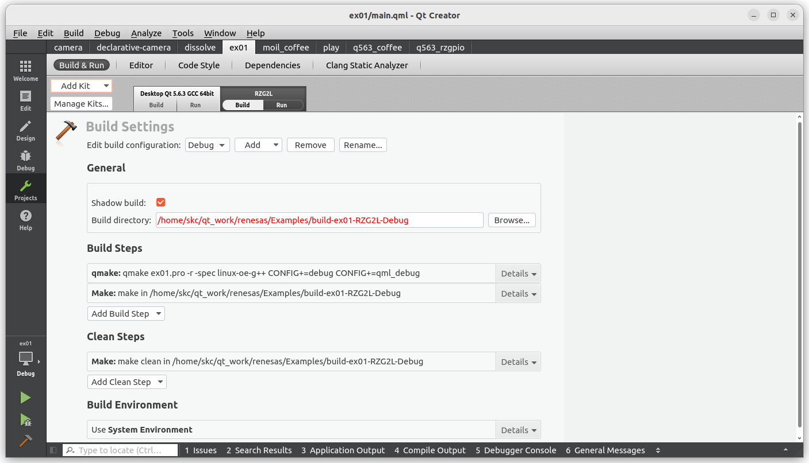
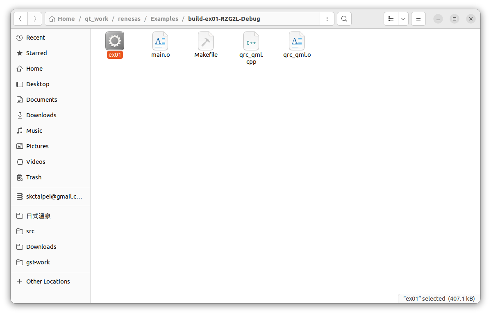

# 3-6 Build executables for RZ/G2L

After period of time of development and check on our PC, suppose now we would like to build a version running on Renesas RZ/G2L target board  

First in the Qt Creator, Click on Projects on the left side,



Click on ```Add Kits, RZ/G2L``` on the upper-left  



Click on build button on the lower-left corner,
the generated executables would be in the folder,

```build-ex01-RZG2L-Debug/ex01```  



Please send to RX/G2L for execution with the scp command,

**Running in Renesas RZ/G2L**  

The Linux image built with ```core-image-qt``` parameter is already come with ssh and scp functions, Since the newer version SSH client on PC will in default perhibit the ssh-rsa algorithm, so you may encounter error messages when you connect to RZ/G2L. This issue can be resolve by adding additional parameter in the command, for example,  

```bash
ssh -v -oHostKeyAlgorithms=+ssh-rsa root@192.168.0.216
```

or, edit ~/.ssh/config,  

```bash
vim ~/.ssh/config
```

add the followings

```bash
Host *
 ServerAliveInterval 10
 HostKeyAlgorithms +ssh-rs
 PubkeyAcceptedKeyTypes +ssh-rsa
```
