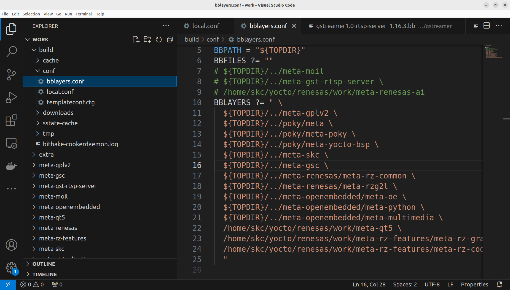

# 1-5 Yocto Layer and Recipe

In the previous sections, we build the Linux image using Yocto project. Here we would like to add our own code into the Yocto project as a part of the Linux image. Finally the executable from the source code can be run on the target Renesas RZ/G2L.  

we partice adding a simple "hello world" to our project. First, we need to edit, compile the execute this "hello world" program on our Ubuntu 22.04 development platform, then we prepare a folder for the source program and other necessary files like .bb receipe file and .conf file. All of those files are required for the Yocto project.

Once we successfully build the Yocto project to the Linux image, run the executable on Renesas RZ/G2L to check if it did work.

**References**  

Please Google using the keywords "Yocto hello world", the below screen shots are just for your reference. Yours can differ.  

https://www.wpgdadatong.com/blog/detail/42091

https://www.youtube.com/watch?v=YSITCPhk_qU

The roughly process is, prepare a simple hello.c program, it simply print out message on the screen. Prepare a .bb file describe the source file location, compile, link and install commands, The below tree shows an example folder structure
of a layer.

```bash
meta-skc
├── conf
│   └── layer.conf
└── recipes-app
    └── hello
        ├── hello_1.0.bb
        └── src             
            └── hello-1.0.tar.gz
```


In the file

build/conf/bblayers.conf  

we need to add the meta-xxx folder to BBLAYERS definition "meta-xxx", ( "meta-skc" for here )  



In the file  

build/conf/local.conf  

we need to add the name of the recipe to the definition of IMAGE_INSTALL:append,  


Please try the above process, congratuations that if you can successfully run the hello world program on Renesas RZ/G2L.

Please try it by yourself first.
The below is for your reference.

[meta-hello](./file/meta-hello.tar.gz)

Please decompress the above file to Yocto working folder, put it at the same layer with meta-renesas, then modify build/conf/local.conf and build/conf/bblayers.conf.

## Supplementary

We already successfully build Yocto project by following the instructions and prepared packages. The topics below will help you to understand Yocto better.  

**Yocto Project Quick Build**

- https://docs.yoctoproject.org/brief-yoctoprojectqs/index.html

**Build Linux image for Raspberry Pi**  

- https://medium.com/nerd-for-tech/build-your-own-linux-image-for-the-raspberry-pi-f61adb799652

- https://hackmd.io/@sss22213/Bk9KwQ5d_

**Non-Yocto Cross Compile**

https://jensd.be/1126/linux/cross-compiling-for-arm-or-aarch64-on-debian-or-ubuntu