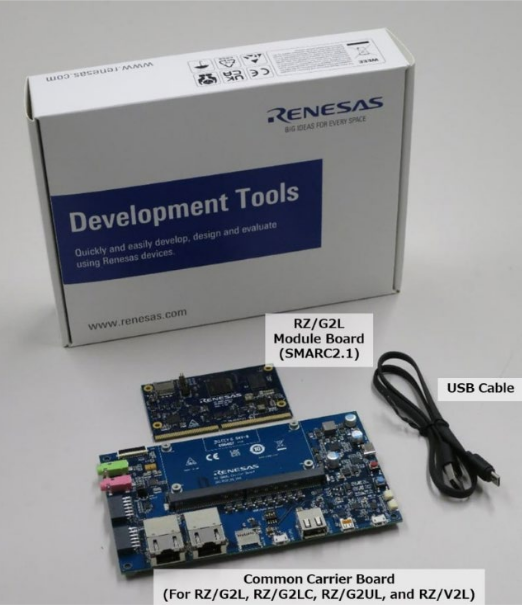

# 2-1 Introduction

In this chapter,
We will learn how to prepare the docker environment and build
a Yocto project for a Linux image running on embedded system.  

Our target hardware is Renesas RZ/G2L.

The official website of Renesas RZ/G2L where you can find the related documents is as below,

[Renesas RZ](https://www.renesas.com/en/products/microcontrollers-microprocessors/rz-mpus/rzg2l-general-purpose-mpu-dual-core-arm-cortex-a55-cpus-and-single-core-cortex-m33-cpu-3d-graphics-and)

Among all of the documents in the above website, the most important one is the below  

[Linux Start-up Guide](https://www.renesas.com/en/document/gde/smarc-evk-rzg2l-rzg2lc-rzg2ul-linux-start-guide-rev104?r=1467981)

You can reference to the above documents, or alternatively follow the guides in the next sections to prepare a environment then build a linux image.  
