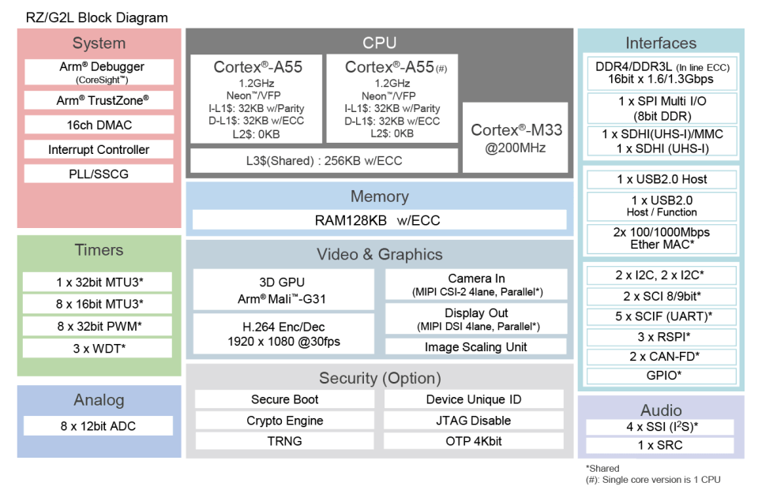

# 2-2 About Renesas RZ/G2L

The hardware block diagram of RZ/G2L is as below. The advantages of embedded system is low power consumption and more reliable. We can develop products base on the embedded system.  



We'll prepare a linux image to run on RZ/G2L.

For RZ/G2L Evaluation Board Kits Quick Start Guide, please check the link below, you'll have an overall  
understand about RZ/G2L. Please learn how to boot up,
reset, and connect to the USB, ethernet, HDMI  

[RZ/G2L EVK - Quick Start Guide](https://www.renesas.com/en/document/qsg/rzg2l-evaluation-board-kit-quick-start-guide?r=1518686)

The most quick way is to download the RZ/G2L VLP pre-built image and try running it.

Follow the instructions in the above document,  
download and write the image to a microSD card.  

The most important commands for writing image to SD
card are,

```bash
sudo apt-get install bmap-tools
sudo bmaptool copy core-image-qt-smarc-rzg2l.wic.gz /dev/sdb
```

For a new RZ/G2L EVK, it's also necessary to write bootloader to the baord, please follow the instruction
to connect PC and RZ/G2L via serial port.
