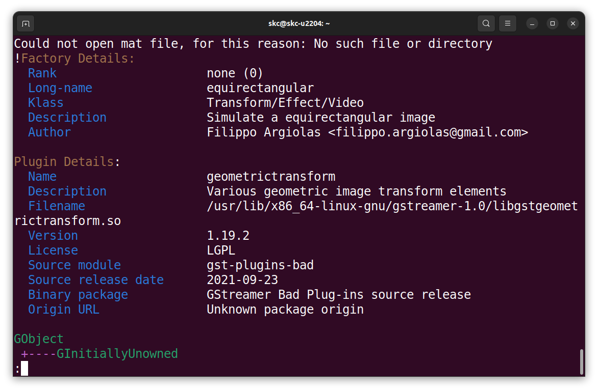
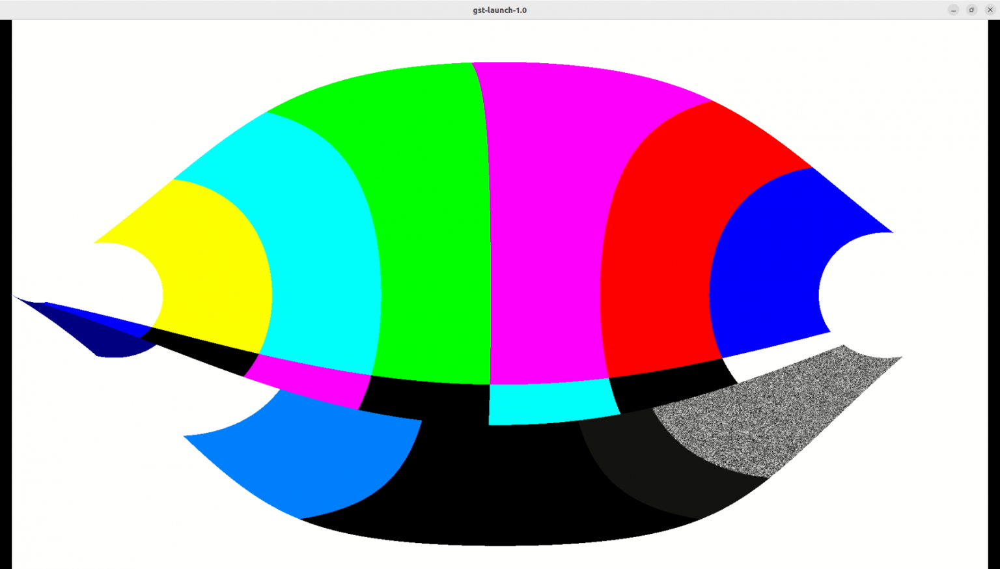
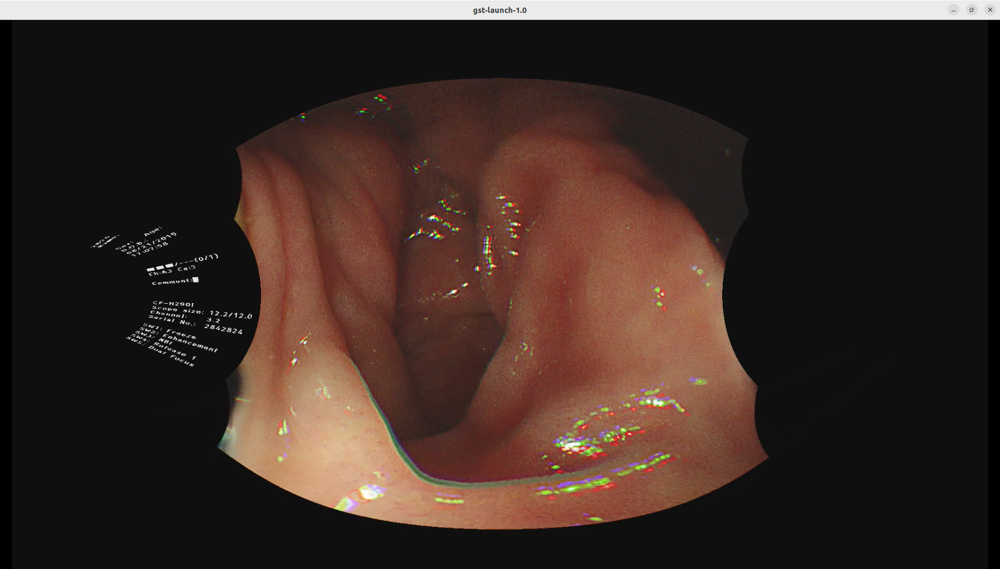
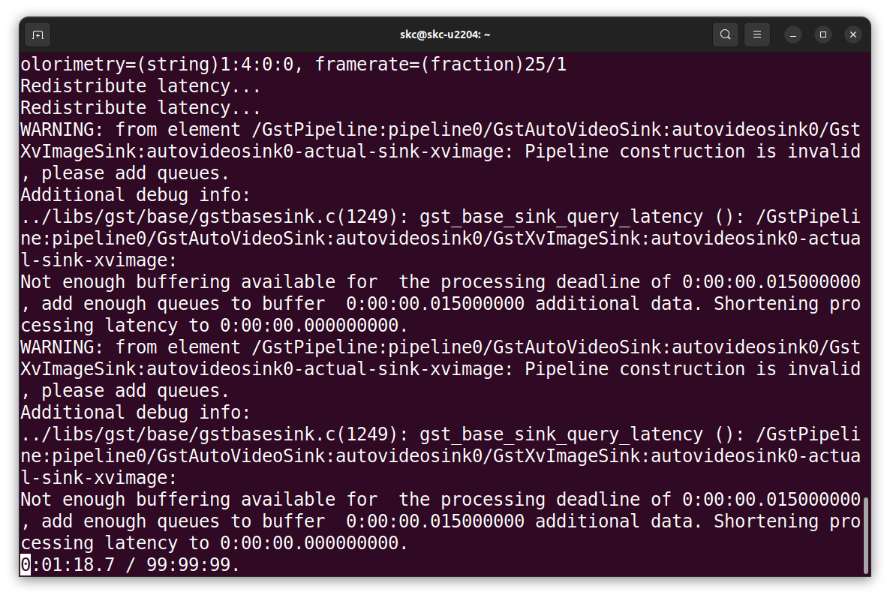
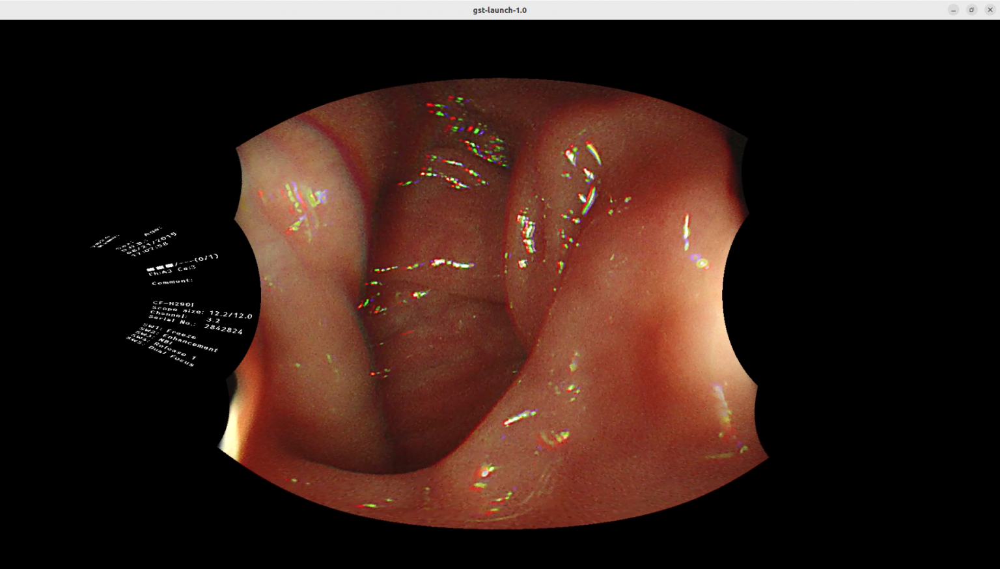
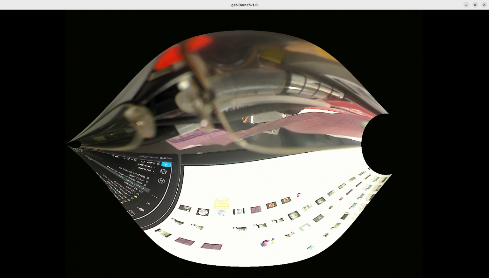

# 2-3 Developing the `gst-plugins-bad-dev` Project on PC

**GStreamer** is a pipeline-based multimedia framework that links together a wide variety of media processing systems to complete complex workflows. For instance, GStreamer can be used to build a system that reads files in one format, processes them, and exports them in another. The formats and processes can be changed in a plug and play fashion.

**GStreamer** is an extremely powerful and versatile framework for creating streaming media applications. However, writing new plugins is not always easy.

[Gstreamer Wiki](https://en.wikipedia.org/wiki/GStreamer)

The below is how Gstreamer elements linked as a pipeline.


A simple example gstreamer command is as below,

```bash
gst-launch-1.0 videotestsrc ! autovideosink 
```

And the output of the above command,


We already have a MOIL Equirectangular Gstreamer element, we hope to use it to link to more applications in the future.

`Environment Setup`

Install GStreamer on Ubuntu 22.04:

```bash
apt-get install libgstreamer1.0-dev libgstreamer-plugins-base1.0-dev libgstreamer-plugins-bad1.0-dev gstreamer1.0-plugins-base gstreamer1.0-plugins-good gstreamer1.0-plugins-bad gstreamer1.0-plugins-ugly gstreamer1.0-libav gstreamer1.0-tools gstreamer1.0-x gstreamer1.0-alsa gstreamer1.0-gl gstreamer1.0-gtk3 gstreamer1.0-qt5 gstreamer1.0-pulseaudio
```

Install the Meson build system:

```bash
sudo apt-get install python3 python3-pip python3-setuptools \
python3-wheel ninja-build
```

`Project Download`

The project mentioned in this section we'll used in the Yocto project building. However, this one is based on a newer Gstreamer version, and is fully compatible with our developing environment Ubuntu 22.04. We can add or modify programs then verify the functionality on our system.

This is the referenced original project on Github:

```bash
https://github.com/GStreamer/gst-plugins-bad
```

Download our modified version project:

```bash
https://github.com/yourskc/gst-plugins-bad-dev
```

This project includes a new element named `equirectangular` as part of the `gst-plugins-bad` geometric transform plugin. It contains GStreamer code units, build instructions, and test commands.

`Build`

```bash
meson build
ninja -C build
```

Verify the creation of `.so` files in:

```bash
<work_dir>/build/gst/geometrictransform
```

Install the library locally for verification:

```bash
sudo cp ./build/gst/geometrictransform/libgstgeometrictransform.so /usr/lib/x86_64-linux-gnu/gstreamer-1.0
```

Check with `gst-inspect-1.0`:

```bash
gst-inspect-1.0 geometrictransform
```

and

```bash
gst-inspect-1.0 equirectangular
```

Expected output:



`Testing`

:::tip
Ensure the execution directory contains `EquimatX` and `EquimatY` files.
:::

Basic test with video test source:

```bash
cd test_env
gst-launch-1.0 videotestsrc ! video/x-raw,width=1920,height=1080 ! videoconvert ! equirectangular ! videoconvert ! autovideosink
```



To test with mp4 video files, use the example below:

```bash
gst-launch-1.0 playbin uri=file:///path/to/video.mp4 video-sink='videoconvert ! equirectangular ! videoconvert ! autovideosink'
```

There some .jpg image files and .mp4 video files
under /test_env folder.  

Change the data folder location in the below command according to your actual situation.

```bash
cd test_env

gst-launch-1.0 playbin uri=file:///home/skc/gst-work/gst-plugins-bad-dev/test_env/endo01.mp4 video-sink=’videoconvert ! equirectangular ! videoconvert ! autovideosink’
```



Another test is as below,

```bash
gst-launch-1.0 filesrc location=endo01.mp4 ! qtdemux ! queue ! avdec_h264 ! videoconvert ! equirectangular ! videoconvert ! autovideosink
```

接下來測試網路串流

首先，先開啟一個 Terminal 作為 udp 的接收端

```bash
gst-launch-1.0 -v udpsrc uri=udp://127.0.0.1:5000 ! application/x-rtp, media=video, payload=96, encoding-name=H264 ! rtph264depay ! avdec_h264 ! videoconvert ! autovideosink
```

The below is the waiting for the incoming stream  



First, we use a very simple video test source,  

```bash
gst-launch-1.0 videotestsrc ! video/x-raw, width=1920, height=1080 ! videoconvert ! equirectangular ! videoconvert ! x264enc ! rtph264pay config-interval=10 ! udpsink host=127.0.0.1 port=5000
```

Then we test a still image source,

```bash
gst-launch-1.0 filesrc location=image1920.jpg ! decodebin ! imagefreeze ! videoscale ! video/x-raw,width=1920,height=1080 ! videoconvert ! equirectangular ! videoconvert ! x264enc ! rtph264pay config-interval=10 ! udpsink host=localhost port=5000
```

the expected output is as below,



`USB Camera`

We connect our PC with an USB camera,
and replace the video source with
"v4l2src device=/dev/video0" in the command,

```bash
gst-launch-1.0 v4l2src device=/dev/video0 ! videoscale ! video/x-raw, width=1920, height=1080 ! videoconvert ! equirectangular ! videoconvert ! x264enc ! rtph264pay config-interval=10 ! udpsink host=localhost port=5000
```

If you cannect with a normal USB camera,
the result screen will be like the below,



The flow of streaming mp4 file is,

Decompression > Transformation > Compression > Streamering

```bash
gst-launch-1.0 filesrc location=endo01.mp4 ! qtdemux ! queue ! avdec_h264 ! videoconvert ! equirectangular ! videoconvert ! x264enc ! rtph264pay config-interval=10 ! udpsink host=localhost port=5000 -v
```

[](https://www.youtube.com/watch?v=1-qJ42QD_ok)
