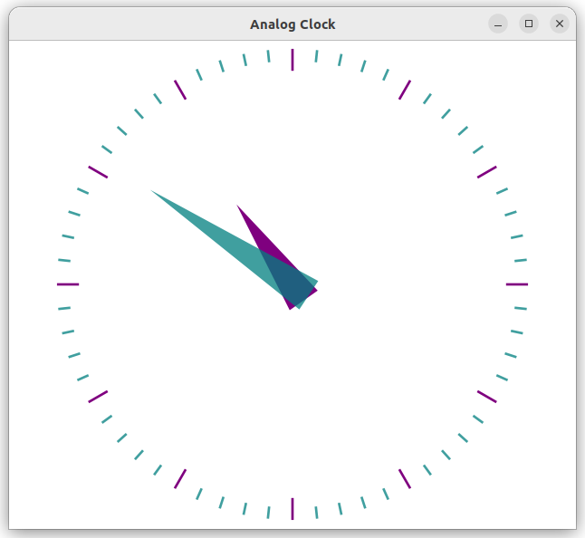

# 3-5 Build Qt Project on Ubuntu 22.04

We are about to create a Qt project, open an example
project for pratice or create a blank new project.

`Examples`

Open Qt Creator, click on the `Welcome` on the left, click on `Examples` and browse to example or existing projects,

Or, you can create a blank project,

Qt Examples are located at the directory as
below, projects are in the sub-directories by catagory

```bash
<Qt Dir>/Examples/Qt-5.6.3/ 
```

for example, if Qt is install under ~

```bash
 ~/Qt5.6.3/Examples/Qt-5.6.3/
```

Please learn Qt from those examples, In Qt Creator,
Click on File/"Open File or Project"

Browse to Examples/gui/analogclock/analogclock.pro

Click on "Run" button in the lower left corner



`New Project`

In the menu, choose `File/ New File or Project/`

Choose  `"Application"/ "Qt Quick Control Application"`

Input project name, for example `ex01`

In "Kit" selection dislog, choose "Desktop Qt 5.6.3 GCC 64bit"

Press green triangle button on the lower-left or press F5 or Ctrl-R to start execution

Since the selected kits is "Desktop", the built executables can be run on PC as below,  


The executable would be in another folder named as

`/build-ex01-Desktop_Qt_5_6_3_GCC_64bit-Debug`

you can also double click on the executable to run it outside of At Creator.

The success of the above steps means We've completely build a environment for development.

You can do the software development to meet your project need by repeating the programming and debugging procedures.

Start from some example projects come with Qt installation is a good way to quickly learn the Qt UI programming. You can add controls like buttons, design the layout, and write program behind the controls to connect them with others.  

For Qt Programming,  
you can start by familiar with those topics,

- QML

QML (Qt Markup Language) 是基於JavaScript 的程式語言, 用於設計圖形使用者介面為主的應用程式.QML 主要用於行動應用程式，注重觸控輸入和使用者體驗.

- Qt Quick

有別於 Qt Wedget,
Qt Quick 是 QML 的 Class 和 Functions 的函數庫, 以 QML 語言來開發圖形介面.

- Qt Quick Controls

是 Qt 框架中的介面模組, 提供了一套視覺化的使用者控制元件. 包含了如按鍵, 文字輸入框, 滑桿等等.
