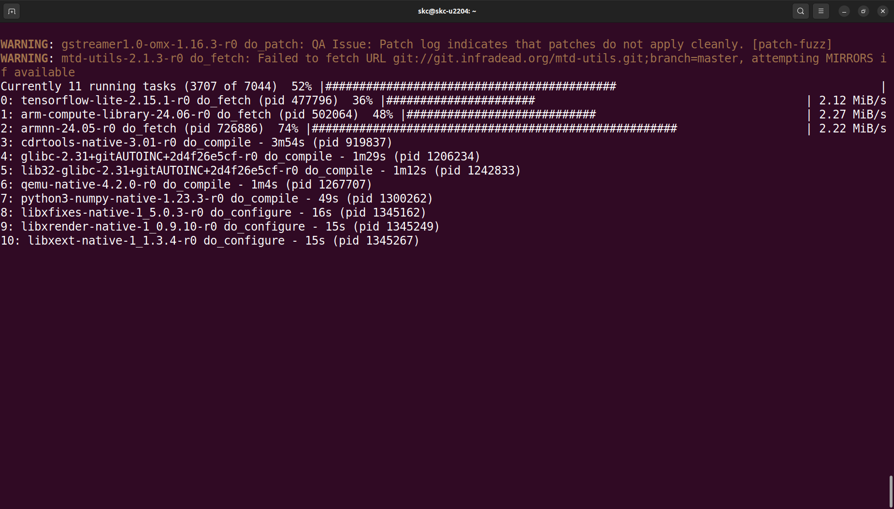

# 1-4 Yocto Project Build

Let's start and enter Docker container,

```bash
docker start my_container_for_20.04
docker exec -it my_container_for_20.04 /bin/bash
```

According to the ```Linux Start-up Guide```,
For the first time, we need to install additional packages
in the Dcoker container,

```bash
sudo apt-get update
sudo apt-get install gawk wget git-core diffstat unzip texinfo gcc-multilib \
build-essential chrpath socat cpio python python3 python3-pip python3-pexpect \
xz-utils debianutils iputils-ping libsdl1.2-dev xterm p7zip-full libyaml-dev \
libssl-dev bmap-tools
```

I would suggest you
to install some additional packages like Cmake and Meson,

```bash
sudo apt update
sudo apt install software-properties-common

sudo apt-add-reporitory 'deb https://apt.kitware.com/ubuntu/ bionic main'
sudo apt update
sudo apt install cmake

sudo apt install meson ninja-build
```

**Each time**, when we enter the container,
it's necessary to run the below to set the environment variables

```bash
cd <work dir> 
TEMPLATECONF=$PWD/meta-renesas/meta-rzg2l/docs/template/conf/ source poky/oe-init-build-env build
```

Start the Yocto build command, there are some choises
of the build option, we would recommend you to use the
most complete build option as below,

```bash
MACHINE=smarc-rzg2l bitbake core-image-qt
```

The build process always takes a long time, it is depend
on the performance of your PC, plase always check for remaining
free space of the harddisk.



Sometimes there are some error message shown and
the build stop at a certain percentage of progress.
It is possible caused by fetch operation ( network problem)
 or sometimes the dependency of the packages was not
 set properly.

 Don't worry, you can try to execute the same command again,
 it is possible to move on for a while. A succefully Yocto
 build not always at the first try.

`Write image to SD card`

After Yocto compilation, check the output directory

```bash
cd build/tmp/deploy/images/smarc-rag2l/
```

The output files of the build are

```bash
core-image-qt-smarc-rzg2l.wic.gz
core-image-qt-smarc-rzg2l.wic.bmap
```

Exit Docker image, insert SD card to the PC

enter the commands below,

```bash
sudo fdisk -l       # check device ID of SD card 
umount /dev/sdc1    # suppose SD card mounted on /dev/sdc1 and /dev/sdc2
umount /dev/sdc2
sudo bmaptool copy core-image-qt-smarc-rzg2l.wic.gz /dev/sdc
```

Remove SD card, insert it to RZ/G2L and boot up. Now you can click on the Qt Demo items or open a terminal
then input some commands for the test.
